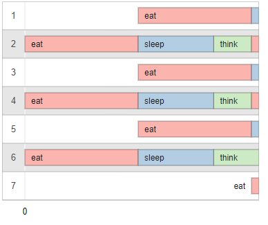
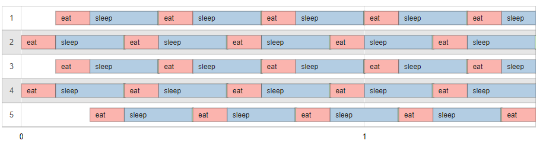

# PHILOSOPHER
Dining philosophers problem simulation for Linux

## Download & Build

```
git clone git@github.com:Elnop/42-Philosophers.git
cd 42-Philosopher/philo
make
```
## Run

```
./philo number_of_philosophers* time_to_die* time_to_eat* time_to_sleep* meal_count_required
```

*\*=required*

## Testing tools

- [Visualiser](https://nafuka11.github.io/philosophers-visualizer/)

- **xclip** : Shell command for instant copy output ``./philo [args] | xclip -selection c``
You can directly CTRL+V in visualizer

## Tests

### Death at time_to_die

```
./philo 2 400 200 100
```

philo dies at 400ms because time_to_die = 400
```
0 2 has taken a fork
0 2 has taken a fork
0 2 is eating
200 2 is sleeping
200 1 has taken a fork
200 1 has taken a fork
200 1 is eating
300 2 is thinking
400 1 is sleeping
400 2 died
```

### Max Meal

```
./philo 2 310 150 100 3
```
- no philo die
- no philo eats 2 times in a row
- all philos eat at least 3 times
- the program continues to run until the last philo has finished eating


```
0 2 has taken a fork
0 2 has taken a fork
0 2 is eating
150 2 is sleeping
150 1 has taken a fork
150 1 has taken a fork
150 1 is eating
250 2 is thinking
300 1 is sleeping
300 2 has taken a fork
300 2 has taken a fork
300 2 is eating
400 1 is thinking
450 2 is sleeping
450 1 has taken a fork
450 1 has taken a fork
450 1 is eating
550 2 is thinking
600 1 is sleeping
600 2 has taken a fork
600 2 has taken a fork
600 2 is eating
700 1 is thinking
750 2 is sleeping
750 1 has taken a fork
750 1 has taken a fork
750 1 is eating
850 2 is thinking
```

### Odd philo count

```
./philo 7 620 300 200
```
one philo dies at time_to_die
```
0 2 has taken a fork
0 2 has taken a fork
0 2 is eating
0 4 has taken a fork
0 4 has taken a fork
0 4 is eating
0 6 has taken a fork
0 6 has taken a fork
0 6 is eating
300 6 is sleeping
300 2 is sleeping
300 1 has taken a fork
300 4 is sleeping
300 5 has taken a fork
300 1 has taken a fork
300 1 is eating
300 5 has taken a fork
300 5 is eating
300 3 has taken a fork
300 3 has taken a fork
300 3 is eating
300 7 has taken a fork
500 6 is thinking
500 2 is thinking
500 4 is thinking
600 5 is sleeping
600 1 is sleeping
600 3 is sleeping
600 7 has taken a fork
600 7 is eating
600 4 has taken a fork
600 4 has taken a fork
600 4 is eating
600 6 has taken a fork
600 2 has taken a fork
600 2 has taken a fork
600 2 is eating
620 6 died
```



```
./philo 5 310 100 200 5
```

